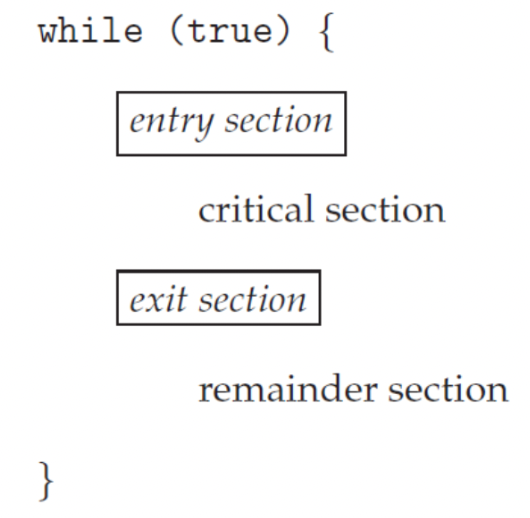

# synchronization

- 공유자원에 동시에 access 할 때 발생한다. 그 부분을 임계영역(critical scetion) 이라고 하고,|
  이부분의 data integrety를 보장해야 한다. 그 방식을 sycnchronization이라고 한다.
  synchronization을 위해선 아래 세가지를 보장해야 한다.

**1. mutual exclusion (상호배제)**

- critical section 내부가 실행줄 일 때, 다른 어떤 스레드나 프로세스가 접근할 수 없다.

**2. progress (데드락 예방)**

- 대기중인 프로세스는 임계영역이 비었을 때 바로 진입할 수 있어야 한다.

**3. boundary waiting (기아 예방)**

- 프로세스는 일정한 기한을 가지고 실행할 수 있어야 한다.