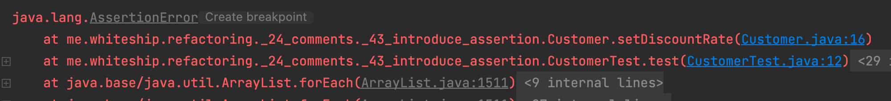
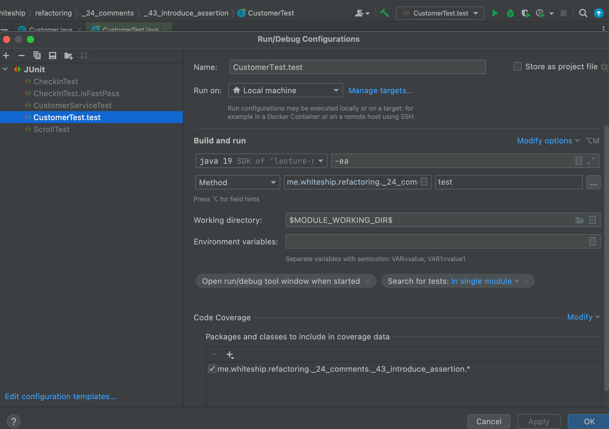

# 냄새 24. 주석 (Comments)

- 주석을 남겨야 할 것 같다면 먼저 코드를 리팩토링하라. 불필요한 주석을 줄일 수 있다.
    - 모든 주석이 나쁘다는 것도 아니고, 주석을 쓰지 말자는 것도 아니다.
    - 주석은 좋은 냄새에 해당하기도 한다.
- 관련 리팩토링
    - “함수 추출하기”를 사용해 설명이 필요한 부분을 별도의 메소드로 빼낸다.
    - “함수 선언부 변경하기”를 사용해 함수 이름을 재정의할 수 있다.
    - 시스템적으로 어떤 필요한 규칙이 있다면, “어서션 추가하기(Introduce Assertion)”을 적용할 수 있다.
    

## 리팩토링 43. 어서션 추가하기 (Introduce Assertion)

- 종종 코드로 표현하지 않았지만 기본적으로 가정하고 있는 조건들이 있다. 그런 조건을 알고리듬을 파악
하거나 주석을 읽으면서 확인할 수 있다.
- 그러한 조건을 Assertion을 사용해서 보다 명시적으로 나타낼 수 있다.
- Assertion은 if나 swtich 문과 달리 “항상” true이길 기대하는 조건을 표현할 때 사용한다.
    - 프로그램이 Assertion에서 실패한다면 프로그래머의 실수로 생각할 수 있다.
    - Assertion이 없어도 프로그램이 동작해야 한다. (자바에서는 컴파일 옵션으로 assert 문을 사용하지않도록 설정할 수도 있다.)
- 특정 부분에선 특정한 상태를 가정하고 있다는 것을 명시적으로 나타냄로써, 의사소통적인 가치를 지니
고 있다.

### 변경 전

```java
public class Customer {

    private Double discountRate;

    public double applyDiscount(double amount) {
        return (this.discountRate != null) ? amount - (this.discountRate * amount) : amount;
    }

    public Double getDiscountRate() {
        return discountRate;
    }

    public void setDiscountRate(Double discountRate) {
        this.discountRate = discountRate;
    }
}
```

### 변경 후

- assert discountRate != null && discountRate > 0;
- 위와 같이 양수값만 입력된다는 것을 표기해 준다.
- 일반적으로 assert옵션을 끄고 컴파일 하기 때문에, assert 키워드는 무시된다.
- 그러므로 해당부분이 로직을 표현한다면 if 등으로 작성해야 하는것이 옳고
- assert는 그런 부분이 이미 만족된 후에도 해당부분에서 강조 등을 하고 싶다면 작성하는 것이다.

```java
public class Customer {

    private Double discountRate;

    public double applyDiscount(double amount) {
        return (this.discountRate != null) ? amount - (this.discountRate * amount) : amount;
    }

    public Double getDiscountRate() {
        return discountRate;
    }

    public void setDiscountRate(Double discountRate) {
        assert discountRate != null && discountRate > 0;
        this.discountRate = discountRate;
    }
}
```

```java
class CustomerTest {

    @Test
    void test() {
        Customer c = new Customer();
        c.setDiscountRate(-5d);

    }
}
```





- intellij의 test코드는 자동으로 assertion을 켜놓는다