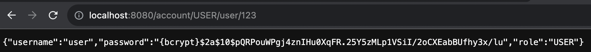
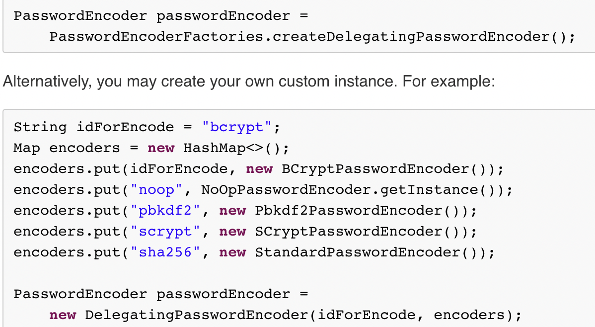

# spring security 정리


[spring reference](https://docs.spring.io/spring-security/reference/index.html)


## Principal 추가

- 인증불가
- 인증이 안되서 현재 사용자가 누군지 모름

~~~java
@GetMapping("/admin")
public String admin(Model model, Principal principal) {
    model.addAttribute("message", "admin : " + principal.getName());
    return "admin";
}
~~~


### spring serucity 추가

- 모든 url 요청은 인증을 해야 한다.
- 기본 유저가 생성된다 (user).

~~~xml
<dependency>
    <groupId>org.springframework.boot</groupId>
    <artifactId>spring-boot-starter-security</artifactId>
</dependency>
~~~

- 어플리케이션 실행 시 기본 인증 아이디 (user) 에 대한 패스워드가 로그에 출력된다.

~~~
Using generated security password: 5b1a3d3b-3458-411f-b0cf-71c4032ed7b8
~~~


## 스프링 시큐리티 설정

- "/", "/info" 인 url은 인증없이 입장
- "/admin" 은 ADMIN 롤 확인한다.
- 그 외에는 인증이 필요

~~~java
@Configuration
public class MySecurityConfig {

    @Bean
    public SecurityFilterChain filterChain(HttpSecurity http) throws Exception {
        http
            .authorizeHttpRequests(
                    authorize -> authorize.requestMatchers("/","/info").permitAll()
                            .requestMatchers("/admin").hasRole("ADMIN")
                            .anyRequest().authenticated()
            );
        http.formLogin(); // 로그인은 form으로 인증
        http.httpBasic();
        return http.build();
    }
}
~~~


### 초기 유저 설정 방법

### 1. 스프링 로딩할 때 기본적으로 유저가 생성


- UserDetailsServiceAutoConfiguration 에서 기본유저를 생성한다.

~~~java
public class UserDetailsServiceAutoConfiguration {
    private static final String NOOP_PASSWORD_PREFIX = "{noop}";
    private static final Pattern PASSWORD_ALGORITHM_PATTERN = Pattern.compile("^\\{.+}.*$");
    private static final Log logger = LogFactory.getLog(UserDetailsServiceAutoConfiguration.class);

    public UserDetailsServiceAutoConfiguration() {
    }

    @Bean
    public InMemoryUserDetailsManager inMemoryUserDetailsManager(SecurityProperties properties, ObjectProvider<PasswordEncoder> passwordEncoder) {
        SecurityProperties.User user = properties.getUser();
        List<String> roles = user.getRoles();
        return new InMemoryUserDetailsManager(new UserDetails[]{User.withUsername(user.getName()).password(this.getOrDeducePassword(user, (PasswordEncoder)passwordEncoder.getIfAvailable())).roles(StringUtils.toStringArray(roles)).build()});
    }
~~~

- 기본 유저 이름은 "user" 를 가져옴.

~~~java
org.springframework.boot.autoconfigure.security.User
public static class User {
        private String name = "user";
        private String password = UUID.randomUUID().toString();
        private List<String> roles = new ArrayList();
        private boolean passwordGenerated = true;
		...
~~~

### 2. application.properties

- 아래처럼 설정할 수 있다.
- 1번의 방법을 대체하여 생성되는 것임.

~~~java
spring.security.user.name=admin
spring.security.user.password=123
spring.security.user.roles=ADMIN
~~~

### 3.  커스텀 생성

- 직접 생성한다.
- 여러 유저를 생성할 수 있다.

~~~java
@Configuration
public class MySecurityConfig {
...
@Bean
    public UserDetailsManager users() {
        UserDetails user = User.withDefaultPasswordEncoder()
                .username("user")
                .password("123")
                .roles("USER")
                .build();
        UserDetails admin = User.withDefaultPasswordEncoder()
                .username("admin")
                .password("123")
                .roles("ADMIN")
                .build();
        InMemoryUserDetailsManager in = new InMemoryUserDetailsManager();
        in.createUser(user);
        in.createUser(admin);
        return in;
    }
~~~


## 스프링 시큐리티 커스터마이징: JPA 연동

~~~java
@Entity
public class Account {

    @Id @GeneratedValue
    private Integer id;

    @Column(unique = true)
    private String username;

    private String password;

    private String role;

    // TODO {noop}"originalpassword"
    // TODO spring-security 는 encode 규칙을 주어야하는데, 아무것도 없을 경우 {noop} 로 작성한다,
    public void encodePassword() {
        this.password = "{noop}" + this.password;
    }
}
~~~

- UserDetailsService 구현체를 Bean에 등롤 했기에
loadUserByUsername 를 통해 인증인가를 위한 UserDetails 객체를 제공.

~~~java
@Service
public class AccountService implements UserDetailsService {

    @Autowired AccountRepository accountRepository;

    @Autowired
    PasswordEncoder passwordEncoder;

    @Override
    public UserDetails loadUserByUsername(String username) throws UsernameNotFoundException {
        Account account = accountRepository.findByUsername(username);
        if (account == null)
            throw new UsernameNotFoundException(username);

        return User.builder()
                .username(account.getUsername())
                .password(account.getPassword())
                .roles(account.getRole())
                .build();
    }

    public Account createAccount(Account account) {
        account.encodePassword(passwordEncoder);
        this.accountRepository.save(account);
        return account;
    }
}
~~~

~~~java
@RestController
public class AccountController {

    @Autowired
    AccountService accountService;

    @GetMapping("/account/{role}/{username}/{password}")
    public Account createAccount(@ModelAttribute Account account) {
        return accountService.createAccount(account);
    }
}
~~~

~~~java
public interface AccountRepository extends JpaRepository<Account, Integer> {
    Account findByUsername(String username);
}
~~~


## 패스워드 Encode 전략

### 1. PasswordEncoder

- 비밀번호가 평문 그대로 저장됩니다.

```
Refactor: {noop} 하드코드 를 대체하여 PasswordEncoder 구현체를 이용해 여러 전략을 사용할 수 있다.
```

~~~java
// AccountService.java
@Autowired PasswordEncoder passwordEncoder;

public Account createAccount(Account account) {
    account.encodePassword(passwordEncoder);
    this.accountRepository.save(account);
    return account;
}
~~~

~~~java
// Main.java
@Bean
public PasswordEncoder passwordEncoder() {
    return NoOpPasswordEncoder.getInstance();
}
~~~

~~~java
/** @deprecated */
@Deprecated
public final class NoOpPasswordEncoder implements PasswordEncoder {
    private static final PasswordEncoder INSTANCE = new NoOpPasswordEncoder();

    private NoOpPasswordEncoder() {
    }

    public String encode(CharSequence rawPassword) {
        return rawPassword.toString();
    }

    public boolean matches(CharSequence rawPassword, String encodedPassword) {
        return rawPassword.toString().equals(encodedPassword);
    }

    public static PasswordEncoder getInstance() {
        return INSTANCE;
    }
}
~~~


### 2. PasswordEncoderFactories

- bcrypt 단방향 해시 알고리즘 으로 인코드 한다.
- 기본 전략인 bcrypt로 암호화 해서 저장하며 비교할 때는 {id}를 확인해서 다양한 인코딩을 지원한다.




[spring-security 5.1.5.RELEASE](https://docs.spring.io/spring-security/site/docs/5.1.5.RELEASE/reference/htmlsingle/#pe-bcpe)



~~~java
/**
 * 기본 bcrypt 해시 알고리즘
 */
@Bean
public PasswordEncoder passwordEncoder() {
    return PasswordEncoderFactories.createDelegatingPasswordEncoder();
}
~~~


