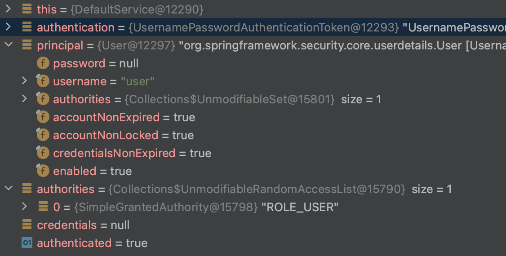
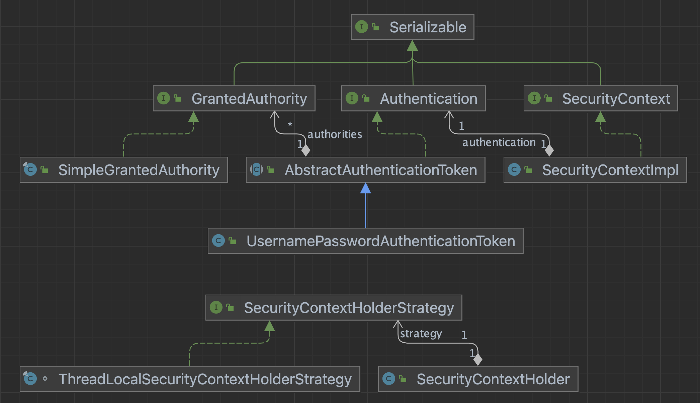

# SecurityContextHolder

- SecurityContextHolder 는 어떤 정보를 갖고 있을까?


### SecurityContextHolder 전략

- SecurityContextHolder 는 정보관리를 위해 여러개 전략이 있는데,
- 기본적으로는 ThreadLocal 을 사용한다.
- 멀티스레딩인 스프링에서는 요청중 ThreadLocal을 통해 Authentication 을 조회할 수 있다.

~~~java
public class SecurityContextHolder {
    public static final String MODE_THREADLOCAL = "MODE_THREADLOCAL";
    public static final String MODE_INHERITABLETHREADLOCAL = "MODE_INHERITABLETHREADLOCAL";
    public static final String MODE_GLOBAL = "MODE_GLOBAL";
    private static final String MODE_PRE_INITIALIZED = "MODE_PRE_INITIALIZED";
    public static final String SYSTEM_PROPERTY = "spring.security.strategy";
    private static String strategyName = System.getProperty("spring.security.strategy");
~~~


### 데이터 확인

- SecurityContextHolder 가 관리하는 데이터를 확인해보자.

~~~java
Authentication authentication = SecurityContextHolder.getContext().getAuthentication();
Object principal = authentication.getPrincipal();
Collection<? extends GrantedAuthority> authorities = authentication.getAuthorities();
Object credentials = authentication.getCredentials();
boolean authenticated = authentication.isAuthenticated();
~~~




### 구조도




### SecurityContextHolder

- SecurityContextHolderStrategy 구현체는 ThreadLocalSecurityContextHolderStrategy 이다.

~~~java
private static SecurityContextHolderStrategy strategy;
public static SecurityContext getContext() {
    return strategy.getContext();
}
~~~


### ThreadLocalSecurityContextHolderStrategy

- SecurityContext 의 ThreaLocal을 만들고 SecurityContextImpl 인스턴스를 getContext() 로 넘긴다.

~~~java
final class ThreadLocalSecurityContextHolderStrategy implements SecurityContextHolderStrategy {

private static final ThreadLocal<Supplier<SecurityContext>> contextHolder = new ThreadLocal();

public SecurityContext createEmptyContext() {
  return new SecurityContextImpl();
}
..
~~~


### SecurityContextImpl

- 여기서 Authentication 타입의 UsernamePasswordAuthenticationToken 인스턴스를 리턴한다.

~~~java
public class SecurityContextImpl implements SecurityContext {
private Authentication authentication;
    public Authentication getAuthentication() {
        return this.authentication;
    }
    ...
~~~


### UsernamePasswordAuthenticationToken

- 여기서 principal의 타입은 실제론 UserDetailsService 이다.

```java
private final Object principal;

public Object getCredentials() {
    return this.credentials;
}

public Object getPrincipal() {
    return this.principal;
}
```


### AbstractAuthenticationToken

- UsernamePasswordAuthenticationToken 의 스켈레톤.

~~~java
private final Collection<GrantedAuthority> authorities;

public Collection<GrantedAuthority> getAuthorities() {
    return this.authorities;
}
    public boolean isAuthenticated() {
    return this.authenticated;
}
~~~


### SimpleGrantedAuthority

- role

~~~java
private final String role;

public String getAuthority() {
    return this.role;
}
~~~


