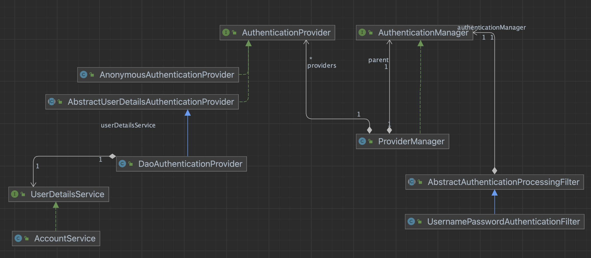

# AuthenticationManager

- form 에서 로그인 시에 user 인증 절차 순서를 작성하였다.
- UsernamePasswordAuthenticationFilter  에서 AuthenticationManager 타입인 ProviderManager 객체의 authenticate 메서드를 통해 인증절차를 거친다.

### UsernamePasswordAuthenticationFilter

- AuthenticationManager 타입인 ProviderManager 객체의 authenticate 메서드를 호출한다.

~~~	java
public Authentication attemptAuthentication(HttpServletRequest request, HttpServletResponse response) throws AuthenticationException {
    		...
        return this.getAuthenticationManager().authenticate(authRequest);
    }
}
~~~

### ProviderManager

- authenticate 메서드로 인증을 시작한다.
- providers 를 반복하면서 AuthenticationProvider타입에 위임하게 되는데, 현재  개수는1개이고, `AnonymousAuthenticationToken` 인스턴스를 갖고 있으나 supports 에서 false된다.
- 결과가 없으면 parent를 호출한다.  `this.parent.authenticate(authentication)`
- 다시 providers 를 반복하는데 이때 supports 는 AbstractUserDetailsAuthenticationProvider 인스턴스의 것을 사용하여 true 가 된다.
- `provider.authenticate(authentication)` 를 호출하고 userCache 가 있는지 확인한다. 
  ( by AbstractUserDetailsAuthenticationProvider)
- 아직 없기 때문에 `retrieveUser` 메서드를 호출하여 `this.getUserDetailsService().loadUserByUsername(username);` 로 우리가 만든 `AccountService` 에서 UserDetails 를 생성후 리턴한다 (by DaoAuthenticationProvider)

~~~java
public class ProviderManager implements AuthenticationManager, MessageSourceAware, InitializingBean {

private static final Log logger = LogFactory.getLog(ProviderManager.class);

private AuthenticationEventPublisher eventPublisher = new NullEventPublisher();

private List<AuthenticationProvider> providers = Collections.emptyList();

private AuthenticationManager parent;
~~~

~~~java
	@Override
	public Authentication authenticate(Authentication authentication) throws AuthenticationException {
		Class<? extends Authentication> toTest = authentication.getClass();
		...
		int size = this.providers.size();
		for (AuthenticationProvider provider : getProviders()) {
			if (!provider.supports(toTest)) {
				continue;
			}
			...
			try {
				result = provider.authenticate(authentication);
			}
			...
    }
		if (result == null && this.parent != null) {
			try {
				parentResult = this.parent.authenticate(authentication);
				result = parentResult;
			}
			catch (ProviderNotFoundException ex) {
			}
		}
		...
	}
~~~

### AnonymousAuthenticationProvider

- suports method 
  - authentication (UsernamePasswordAuthenticationToken) 은 AnonymousAuthenticationToken에 할당이 안되므로 false 리턴.

~~~java
public class AnonymousAuthenticationProvider implements AuthenticationProvider, MessageSourceAware {
...
	@Override
	public boolean supports(Class<?> authentication) {
		return (AnonymousAuthenticationToken.class.isAssignableFrom(authentication));
	}
	...
~~~

### AbstractUserDetailsAuthenticationProvider

- DaoAuthenticationProvider 체크 시 해당 클래스의 supports 를 체크해서 true 를 리턴한다.
- retrieveUser 메서드는 DaoAuthenticationProvider 객체의 것을 호출함.

~~~java

public abstract class AbstractUserDetailsAuthenticationProvider
		implements AuthenticationProvider, InitializingBean, MessageSourceAware {
		
private UserCache userCache = new NullUserCache();

  
	@Override
	public boolean supports(Class<?> authentication) {
		return (UsernamePasswordAuthenticationToken.class.isAssignableFrom(authentication));
	}
  
  @Override
public Authentication authenticate(Authentication authentication) throws AuthenticationException {

  UserDetails user = this.userCache.getUserFromCache(username);
  if (user == null) {
    cacheWasUsed = false;
    try {
      user = retrieveUser(username, (UsernamePasswordAuthenticationToken) authentication);
    }
    catch (UsernameNotFoundException ex) {
      ...
    }
    ...
	}
~~~

### DaoAuthenticationProvider

- UserDetailsService 타입의 loadUserByUsername 를 호출한다. 
- 여기서 UserDatailsService는 AccountService 가 구현했다.

~~~java
public class DaoAuthenticationProvider extends AbstractUserDetailsAuthenticationProvider {

private UserDetailsService userDetailsService;

@Override
protected final UserDetails retrieveUser(String username, UsernamePasswordAuthenticationToken authentication)
    throws AuthenticationException {
  prepareTimingAttackProtection();
  try {
    UserDetails loadedUser = this.getUserDetailsService().loadUserByUsername(username);
  ...
    return loadedUser;
  }
...
}
~~~

