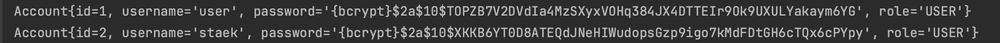

# Threadlocal

~~~java
@GetMapping("/threadlocal")
public String threadlocal(Model model, Principal principal) {
    model.addAttribute("message", "principal : " + principal.getName());

    /**
     * ThreadLocal 초기화
     */
    AccountContext.setAccount(accountRepository.findByUsername(principal.getName()));
    accountService.printUsername();
    return "dashboard";
}
~~~

~~~java
/**
 * ThreadLocal은 요청(thread) 별로 제네릭 타입 정보가 격리되어 있기 때문에,
 * 인자를 받지 않고도 해당 thread의 제네릭타입 정보를 얻을 수 있다.
 */
public void printUsername() {
    Account account = AccountContext.getAccount();
    System.out.println(account.toString());
}
~~~

~~~java
public class AccountContext {
    private static final ThreadLocal<Account> LOCAL = new ThreadLocal<>();

    public static void setAccount(Account account) {
        LOCAL.set(account);
    }
    public static Account getAccount() {
        return LOCAL.get();
    }
}
~~~

- 다른 스레드 (브라우저 세션) 에서 get url 요청 했을 때 AccountContext ThreadLocal 값을 꺼내 테스트.

