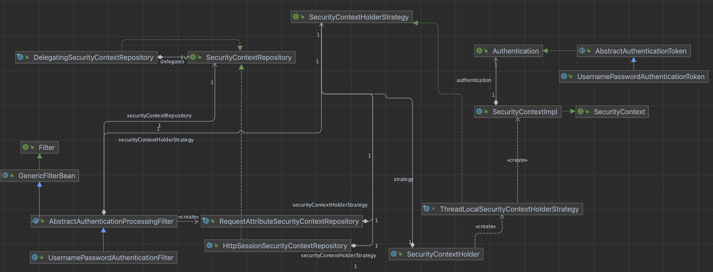

# SecurityContextHolder 정보 세팅


- AbstractAuthenticationProcessingFilter 에서 doFilter 메서드 내부에 Authentication authenticationResult = attemptAuthentication(request, response) 으로 인증 결과를 받고
- successfulAuthentication(request, response, chain, authenticationResult); 으로 ThreadLocal, ContextRepository 에 Authentication 정보를 세팅하는 순서를 작성하였다.





### AbstractAuthenticationProcessingFilter

-  attemptAuthentication(request, response); 메서드로 인증한 이후 set 하는 과정
- ThreadLocalSecurityContextHolderStrategy 에서  SecurityContextImpl 인스턴스 생성 (SecurityContext 타입)
  - SecurityContext 에 Authentication 타입인 UsernamePasswordAuthenticationToken 세팅
- SecurityContextRepository 타입인 RequestAttributeSecurityContextRepository 인스턴스에 SecurityContext타입을 세팅하는데, SecurityContextRepository 타입의 List에 모두 담는다.
- 하나는 HttpSessionSecurityContextRepository, 하나는 RequestAttributeSecurityContextRepository 이다.

```java
protected void successfulAuthentication(HttpServletRequest request, HttpServletResponse response, FilterChain chain,
    Authentication authResult) throws IOException, ServletException {
  SecurityContext context = this.securityContextHolderStrategy.createEmptyContext();
  context.setAuthentication(authResult);
  this.securityContextHolderStrategy.setContext(context);
  this.securityContextRepository.saveContext(context, request, response);
  if (this.logger.isDebugEnabled()) {
    this.logger.debug(LogMessage.format("Set SecurityContextHolder to %s", authResult));
  }
  this.rememberMeServices.loginSuccess(request, response, authResult);
  if (this.eventPublisher != null) {
    this.eventPublisher.publishEvent(new InteractiveAuthenticationSuccessEvent(authResult, this.getClass()));
  }
  this.successHandler.onAuthenticationSuccess(request, response, authResult);
}
```


### SecurityContextImpl

~~~java
@Override
public void setAuthentication(Authentication authentication) {
  this.authentication = authentication;
}
~~~


### ThreadLocalSecurityContextHolderStrategy

-   **this.securityContextHolderStrategy.setContext(context);**

~~~java
final class ThreadLocalSecurityContextHolderStrategy implements SecurityContextHolderStrategy {

	private static final ThreadLocal<Supplier<SecurityContext>> contextHolder = new ThreadLocal<>();
  ...
@Override
public void setContext(SecurityContext context) {
  Assert.notNull(context, "Only non-null SecurityContext instances are permitted");
  contextHolder.set(() -> context);
}
  ...
~~~


### DelegatingSecurityContextRepository

- **this.securityContextRepository.saveContext(context, request, response);**
- HttpSessionSecurityContextRepository,  RequestAttributeSecurityContextRepository 에 context를 저장한다.

~~~java
@Override
public void saveContext(SecurityContext context, HttpServletRequest request, HttpServletResponse response) {
  for (SecurityContextRepository delegate : this.delegates) {
    delegate.saveContext(context, request, response);
  }
}
~~~


### HttpSessionSecurityContextRepository

~~~java
@Override
public void saveContext(SecurityContext context, HttpServletRequest request, HttpServletResponse response) {
  SaveContextOnUpdateOrErrorResponseWrapper responseWrapper = WebUtils.getNativeResponse(response,
      SaveContextOnUpdateOrErrorResponseWrapper.class);
  if (responseWrapper == null) {
    saveContextInHttpSession(context, request);
    return;
  }
  responseWrapper.saveContext(context);
}
~~~

### RequestAttributeSecurityContextRepository

~~~java
@Override
public void saveContext(SecurityContext context, HttpServletRequest request, HttpServletResponse response) {
  request.setAttribute(this.requestAttributeName, context);
}
~~~


