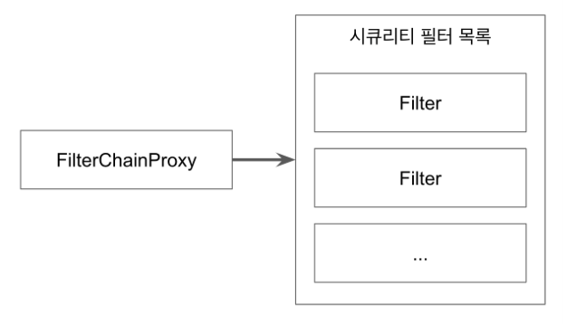
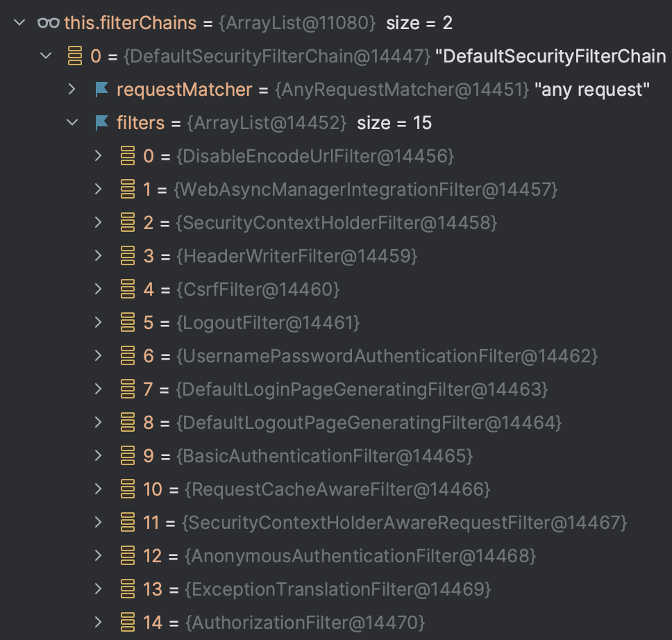
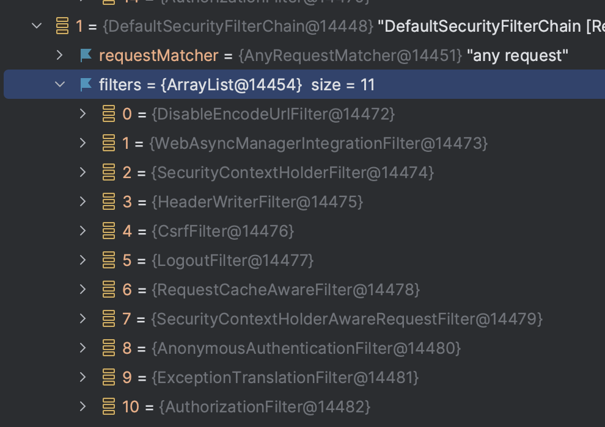

# FilterChainProxy

### MySecurityConfig

~~~java
@Configuration
@Order(Ordered.LOWEST_PRECEDENCE - 100)
public class MySecurityConfig {

    @Bean
    public SecurityFilterChain filterChain(HttpSecurity http) throws Exception {
        http
            .authorizeHttpRequests(
                    authorize -> authorize.requestMatchers("/","info", "/account/**").permitAll()
                            .requestMatchers("/admin").hasRole("ADMIN")
                            .anyRequest().authenticated()
            );
        http.formLogin();
        http.httpBasic();
        return http.build();
    }
}
~~~

### SecondSecurityConfig

~~~java
@Configuration
@Order(Ordered.LOWEST_PRECEDENCE - 15)
public class SecondSecurityConfig {

    @Bean
    public SecurityFilterChain filterChain2(HttpSecurity http) throws Exception {
        http
                .authorizeHttpRequests(
                        authorize -> authorize.requestMatchers("/account/**").permitAll()
                );
        return http.build();
    }

}
~~~

~~~java
private List<Filter> getFilters(HttpServletRequest request) {
  int count = 0;
  for (SecurityFilterChain chain : this.filterChains) {
    if (logger.isTraceEnabled()) {
      logger.trace(LogMessage.format("Trying to match request against %s (%d/%d)", chain, ++count,
          this.filterChains.size()));
    }
    if (chain.matches(request)) {
      return chain.getFilters();
    }
  }
  return null;
}

@Override
public void doFilter(ServletRequest request, ServletResponse response) throws IOException, ServletException {
  if (this.currentPosition == this.size) {
    this.originalChain.doFilter(request, response);
    return;
  }
  this.currentPosition++;
  Filter nextFilter = this.additionalFilters.get(this.currentPosition - 1);
  if (logger.isTraceEnabled()) {
    String name = nextFilter.getClass().getSimpleName();
    logger.trace(LogMessage.format("Invoking %s (%d/%d)", name, this.currentPosition, this.size));
  }
  nextFilter.doFilter(request, response, this);
}
~~~

### filter 목록 (15)

~~~
WebAsyncManagerIntergrationFilter
SecurityContextPersistenceFilter
HeaderWriterFilter
CsrfFilter
LogoutFilter
UsernamePasswordAuthenticationFilter
DefaultLoginPageGeneratingFilter
DefaultLogoutPageGeneratingFilter
BasicAuthenticationFilter
RequestCacheAwareFtiler
SecurityContextHolderAwareReqeustFilter
AnonymouseAuthenticationFilter
SessionManagementFilter
ExeptionTranslationFilter
FilterSecurityInterceptor
~~~

