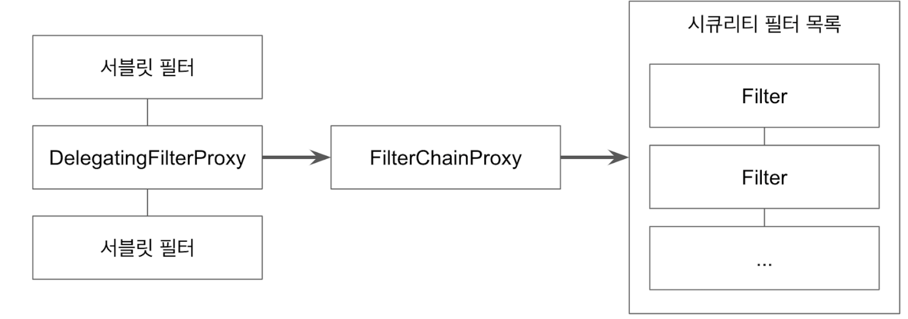
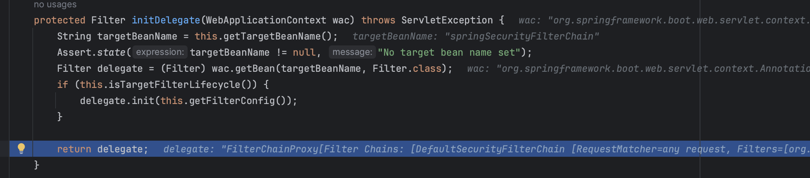
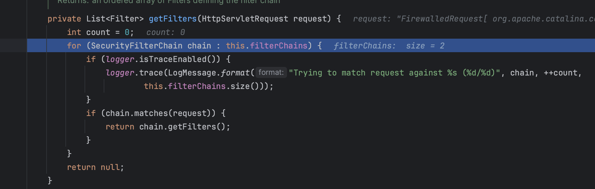

# DelegatingFilterProxy

- 일반적인 서블릿 필터. -> 같은 필터인데, 서블릿 필터, 시큐리티 필터를 따로 나누는 이유

- 서블릿 필터 처리를 스프링에 들어있는 빈으로 위임하고 싶을 때 사용하는 서블릿 필터.
- 타겟 빈 이름을 설정한다.
- 스프링 부트 없이 스프링 시큐리티 설정할 때는 AbstractSecurityWebApplicationInitializer를 사용해서 등록.
- 스프링 부트를 사용할 때는 자동으로 등록 된다. (SecurityFilterAutoConfiguration)

### SecurityFilterAutoConfiguration

~~~java
public class SecurityFilterAutoConfiguration {
    private static final String DEFAULT_FILTER_NAME = "springSecurityFilterChain";

...
public DelegatingFilterProxyRegistrationBean securityFilterChainRegistration(SecurityProperties securityProperties) {
    DelegatingFilterProxyRegistrationBean registration = new DelegatingFilterProxyRegistrationBean("springSecurityFilterChain", new ServletRegistrationBean[0]);
    registration.setOrder(securityProperties.getFilter().getOrder());
    registration.setDispatcherTypes(this.getDispatcherTypes(securityProperties));
    return registration;
}
~~~

### DelegatingFilterProxyRegistrationBean

- **targetname : springSecurityFilterChain**

~~~java
public class DelegatingFilterProxyRegistrationBean extends AbstractFilterRegistrationBean<DelegatingFilterProxy> implements ApplicationContextAware {
  ...
    public DelegatingFilterProxy getFilter() {
        return new DelegatingFilterProxy(this.targetBeanName, this.getWebApplicationContext()) {
            protected void initFilterBean() throws ServletException {
            }
        };
    }
~~~

### DelegatingFilterProxy

~~~java
public void doFilter(ServletRequest request, ServletResponse response, FilterChain filterChain) throws ServletException, IOException {
    Filter delegateToUse = this.delegate;
    if (delegateToUse == null) {
        synchronized(this.delegateMonitor) {
            delegateToUse = this.delegate;
            if (delegateToUse == null) {
                WebApplicationContext wac = this.findWebApplicationContext();
                if (wac == null) {
                    throw new IllegalStateException("No WebApplicationContext found: no ContextLoaderListener or DispatcherServlet registered?");
                }

                delegateToUse = this.initDelegate(wac);
            }

            this.delegate = delegateToUse;
        }
    }

    this.invokeDelegate(delegateToUse, request, response, filterChain);
}
~~~

~~~java
protected void invokeDelegate(Filter delegate, ServletRequest request, ServletResponse response, FilterChain filterChain) throws ServletException, IOException {
    delegate.doFilter(request, response, filterChain);
}
~~~

### FilterChainProxy

### 

~~~java
	private List<Filter> getFilters(HttpServletRequest request) {
		int count = 0;
		for (SecurityFilterChain chain : this.filterChains) {
			if (logger.isTraceEnabled()) {
				logger.trace(LogMessage.format("Trying to match request against %s (%d/%d)", chain, ++count,
						this.filterChains.size()));
			}
			if (chain.matches(request)) {
				return chain.getFilters();
			}
		}
		return null;
	}
~~~

