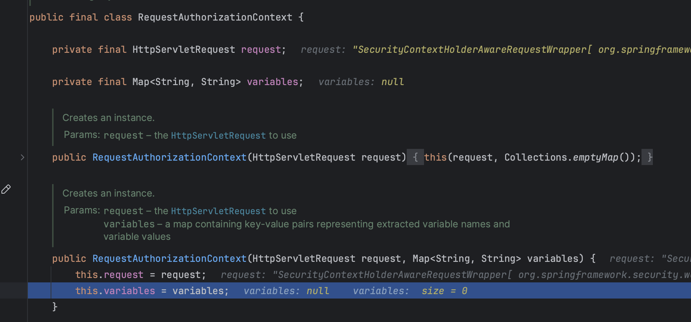

# AccessDecisionManager

### AuthorizationFilter

~~~java
public class AuthorizationFilter extends GenericFilterBean {

	private SecurityContextHolderStrategy securityContextHolderStrategy = SecurityContextHolder
		.getContextHolderStrategy();

	private final AuthorizationManager<HttpServletRequest> authorizationManager;
	
	
		@Override
	public void doFilter(ServletRequest servletRequest, ServletResponse servletResponse, FilterChain chain)
			throws ServletException, IOException {

		HttpServletRequest request = (HttpServletRequest) servletRequest;
		HttpServletResponse response = (HttpServletResponse) servletResponse;

		if (this.observeOncePerRequest && isApplied(request)) {
			chain.doFilter(request, response);
			return;
		}

		if (skipDispatch(request)) {
			chain.doFilter(request, response);
			return;
		}

		String alreadyFilteredAttributeName = getAlreadyFilteredAttributeName();
		request.setAttribute(alreadyFilteredAttributeName, Boolean.TRUE);
		try {
			AuthorizationDecision decision = this.authorizationManager.check(this::getAuthentication, request);
			this.eventPublisher.publishAuthorizationEvent(this::getAuthentication, request, decision);
			if (decision != null && !decision.isGranted()) {
				throw new AccessDeniedException("Access Denied");
			}
			chain.doFilter(request, response);
		}
		finally {
			request.removeAttribute(alreadyFilteredAttributeName);
		}
	}
~~~

### RequestMatcherDelegatingAuthorizationManager

- 매핑패턴 매칭정보를 순회하면서 찾는다.

  

~~~java
	@Override
	public AuthorizationDecision check(Supplier<Authentication> authentication, HttpServletRequest request) {
		if (this.logger.isTraceEnabled()) {
			this.logger.trace(LogMessage.format("Authorizing %s", request));
		}
		for (RequestMatcherEntry<AuthorizationManager<RequestAuthorizationContext>> mapping : this.mappings) {

			RequestMatcher matcher = mapping.getRequestMatcher();
			MatchResult matchResult = matcher.matcher(request);
			if (matchResult.isMatch()) {
				AuthorizationManager<RequestAuthorizationContext> manager = mapping.getEntry();
				if (this.logger.isTraceEnabled()) {
					this.logger.trace(LogMessage.format("Checking authorization on %s using %s", request, manager));
				}
				return manager.check(authentication,
						new RequestAuthorizationContext(request, matchResult.getVariables()));
			}
		}
~~~

### RequestAuthorizationContext

- request 정보 가져옴

## ** 이미 인증 된 사용자 **

### AuthenticatedAuthorizationManager

~~~java
public AuthorizationDecision check(Supplier<Authentication> authentication, T object) {
    return this.delegate.check(authentication, this.authorities);
}
~~~

### AuthoritiesAuthorizationManager

- 인증된 사용자 아니면 앞에로직(check) 생략

~~~java
public AuthorityAuthorizationDecision check(Supplier<Authentication> authentication, Collection<String> authorities) {
    boolean granted = this.isGranted((Authentication)authentication.get(), authorities);
    return new AuthorityAuthorizationDecision(granted, AuthorityUtils.createAuthorityList(authorities));
}
~~~

~~~java
private abstract static class AbstractAuthorizationStrategy {
    AuthenticationTrustResolver trustResolver = new AuthenticationTrustResolverImpl();

    private AbstractAuthorizationStrategy() {
    }

    private void setTrustResolver(AuthenticationTrustResolver trustResolver) {
        Assert.notNull(trustResolver, "trustResolver cannot be null");
        this.trustResolver = trustResolver;
    }

    abstract boolean isGranted(Authentication authentication);
}
~~~

### AuthorizeHttpRequestsConfigurer

- allPermit

~~~
public final class AuthorizeHttpRequestsConfigurer<H extends HttpSecurityBuilder<H>> extends AbstractHttpConfigurer<AuthorizeHttpRequestsConfigurer<H>, H> {
    static final AuthorizationManager<RequestAuthorizationContext> permitAllAuthorizationManager = (a, o) -> {
        return new AuthorizationDecision(true);
    };
~~~

## Exception

~~~java
	private void handleSpringSecurityException(HttpServletRequest request, HttpServletResponse response,
			FilterChain chain, RuntimeException exception) throws IOException, ServletException {
		if (exception instanceof AuthenticationException) {
			handleAuthenticationException(request, response, chain, (AuthenticationException) exception);
		}
		else if (exception instanceof AccessDeniedException) {
			handleAccessDeniedException(request, response, chain, (AccessDeniedException) exception);
		}
	}
~~~

~~~java
	private void handleAccessDeniedException(HttpServletRequest request, HttpServletResponse response,
			FilterChain chain, AccessDeniedException exception) throws ServletException, IOException {
		Authentication authentication = this.securityContextHolderStrategy.getContext().getAuthentication();
		boolean isAnonymous = this.authenticationTrustResolver.isAnonymous(authentication);
		if (isAnonymous || this.authenticationTrustResolver.isRememberMe(authentication)) {
			if (logger.isTraceEnabled()) {
				logger.trace(LogMessage.format("Sending %s to authentication entry point since access is denied",
						authentication), exception);
			}
			sendStartAuthentication(request, response, chain,
					new InsufficientAuthenticationException(
							this.messages.getMessage("ExceptionTranslationFilter.insufficientAuthentication",
									"Full authentication is required to access this resource")));
		}
		else {
			if (logger.isTraceEnabled()) {
				logger.trace(
						LogMessage.format("Sending %s to access denied handler since access is denied", authentication),
						exception);
			}
			this.accessDeniedHandler.handle(request, response, exception);
		}
	}
~~~

