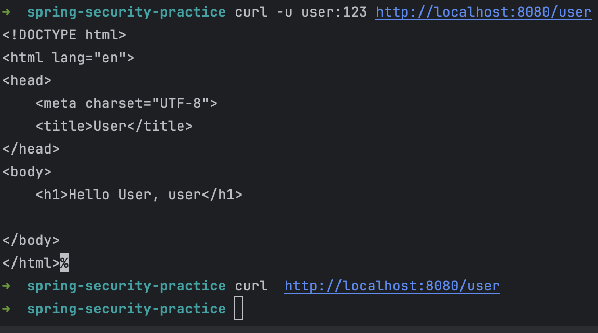

# BasicAuthenticationFilter

- http.httpBasic(); 를 작성했을 때 수행되는 필터이다.

~~~java
http
    .authorizeHttpRequests(
            authorize -> authorize.requestMatchers("/","info", "/account/**").permitAll()
                    .requestMatchers("/admin").hasRole("ADMIN")
                    .requestMatchers("/user").access(access) // 계층구조 설정 추가
                    .anyRequest().authenticated()

    );
http.httpBasic();
~~~

- 인증과정을 거치지만, 캐시에 저장하지 않아 stateless 하다.
- jwt 인증 구현 시 재정의하여 사용할 수 있다.

~~~java
 public class BasicAuthenticationFilter extends OncePerRequestFilter {
 ...
 
 String username = authRequest.getName();
            this.logger.trace(LogMessage.format("Found username '%s' in Basic Authorization header", username));
            if (this.authenticationIsRequired(username)) {
                Authentication authResult = this.authenticationManager.authenticate(authRequest);
                SecurityContext context = this.securityContextHolderStrategy.createEmptyContext();
                context.setAuthentication(authResult);
                this.securityContextHolderStrategy.setContext(context);
                if (this.logger.isDebugEnabled()) {
                    this.logger.debug(LogMessage.format("Set SecurityContextHolder to %s", authResult));
                }

                this.rememberMeServices.loginSuccess(request, response, authResult);
                this.securityContextRepository.saveContext(context, request, response);
                this.onSuccessfulAuthentication(request, response, authResult);
            }
            
           ...
           }
            
~~~

### test

